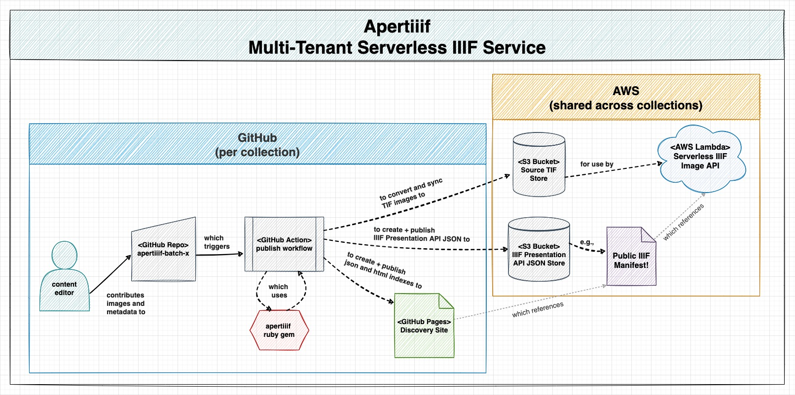

# Apertiiif
[](https://github.com/nyu-dss/apertiiif/actions/workflows/rspec.yml)
[](https://github.com/nyu-dss/apertiiif/actions/workflows/reek.yml)
[](https://github.com/nyu-dss/apertiiif/actions/workflows/rubocop.yml)  

[](https://codeclimate.com/github/nyu-dss/apertiiif/maintainability) [](https://codeclimate.com/github/nyu-dss/apertiiif/test_coverage)

TODO: Description

## Installation

Install the gem and add to the application's Gemfile by executing:

``` sh
bundle add apertiiif
```

## Overview

[](./docs/apertiiif.jpg)
> View as [PDF](./docs/apertiiif.pdf).

## Usage

TODO: Write usage instructions here

## Development

TODO
